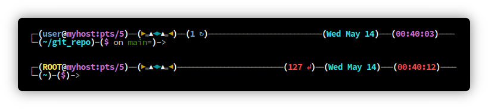

<h1>
    <a href="https://betterbash.cz0.cz">
    
    </a>
</h1>
  
  
# :point_right: Visit [betterbash.cz0.cz](https://betterbash.cz0.cz) for WebUI configurator! :point_left:

## :sparkles: Features
- :zap: Simple installation without dependencies or additional fonts.
- :performing_arts: Username (highlighted if root) and hostname.
- :art: Unique host avatar based on hostname. Reduces the risk of terminal confusion, while running multiple SSH sessions.
- :1234: Shows number of background processes if more than zero.
- :straight_ruler: Line separating commands output.
- :arrow_down: Shows exit code if other than zero.
- :clock4: Date and time. Time changes color if exit code other than zero.
- :file_folder: Current directory.
- :traffic_light: Git status (if current directory inside git repository).
- :scroll: Rapid history search with up/down arrows based on current input.

## Preview
<p align="center">
    <a href="https://betterbash.cz0.cz">
    
    </a>
</p>

### :star: Give a Star! 

Support this project by **giving it a star**. Thanks!

## :rocket: Install:
with **curl**
```
curl -sL https://bb.cz0.cz/vN-y_5uA/getbb.sh | bash -s curl && . ~/.bashrc
```
with **wget**
```
wget -q -O - https://bb.cz0.cz/vN-y_5uA/getbb.sh | bash -s wget && . ~/.bashrc
```
with **openssl** (no dependencies needed)
```
echo -e "GET /vN-y_5uA/getbb.sh HTTP/1.1\r\nHost: bbb-f4hxb4escnacbpe6.westeurope-01.azurewebsites.net\r\nConnection: close\r\n\r\n" \
| openssl s_client -quiet -connect bbb-f4hxb4escnacbpe6.westeurope-01.azurewebsites.net:443 2>/dev/null \
| sed '1,/^\r$/d' | bash -s openssl && . ~/.bashrc
```
## :wrench: Uninstall:
bash session needs a restart in order to uninstall to take effect.

with **curl**
```
curl -sL https://bb.cz0.cz/vN-y_5uA/removebb.sh | bash -s curl
```
with **wget**
```
wget -q -O - https://bb.cz0.cz/vN-y_5uA/removebb.sh | bash -s wget
```
with **openssl** (no dependencies needed)
```
echo -e "GET /vN-y_5uA/removebb.sh HTTP/1.1\r\nHost: bbb-f4hxb4escnacbpe6.westeurope-01.azurewebsites.net\r\nConnection: close\r\n\r\n" \
| openssl s_client -quiet -connect bbb-f4hxb4escnacbpe6.westeurope-01.azurewebsites.net:443 2>/dev/null \
| sed '1,/^\r$/d' | bash -s openssl && . ~/.bashrc
```

## :bar_chart: Star History

[](https://www.star-history.com/#czoczo/BetterBash&Date)


## License

GNU General Public License v3.0 or later

See [LICENSE](LICENSE) to see the full text.
