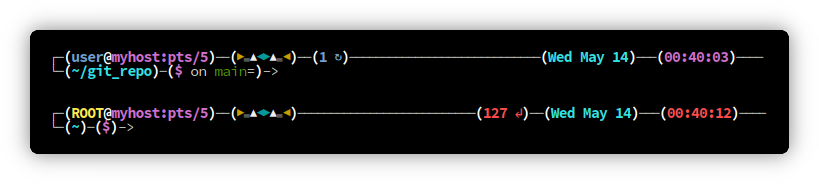

<h1>
    <a href="https://betterbash.cz0.cz">
    
    </a>
</h1>
  
  
# :point_right: Visit [betterbash.cz0.cz](https://betterbash.cz0.cz) for WebUI configurator! :point_left:

## :sparkles: Features
- :zap: Simple installation without dependencies or additional fonts.
- :performing_arts: Username (highlighted if root) and hostname.
- :art: Unique host avatar based on hostname. Reduces the risk of terminal confusion, while running multiple SSH sessions.
- :1234: Shows number of background processes if more than zero.
- :straight_ruler: Line separating commands output.
- :arrow_down: Shows exit code if other than zero.
- :clock4: Date and time. Time changes color if exit code other than zero.
- :file_folder: Current directory.
- :traffic_light: Git status (if current directory inside git repository).
- :scroll: Rapid history search with up/down arrows based on current input.

## Preview
<p align="center">
    <a href="https://betterbash.cz0.cz">
    
    </a>
</p>

### :star: Give a Star! 

Support this project by **giving it a star**. Thanks!

## :rocket: Install:
with **curl**
```
curl -sL https://bb.cz0.cz/vN-y_5uA/getbb.sh | bash -s curl && . ~/.bashrc
```
with **wget**
```
wget -q -O - https://bb.cz0.cz/vN-y_5uA/getbb.sh | bash -s wget && . ~/.bashrc
```
with **openssl** (no dependencies needed)
```
echo -e "GET /vN-y_5uA/getbb.sh HTTP/1.1\r\nHost: bbb-f4hxb4escnacbpe6.westeurope-01.azurewebsites.net\r\nConnection: close\r\n\r\n" \
| openssl s_client -quiet -connect bbb-f4hxb4escnacbpe6.westeurope-01.azurewebsites.net:443 2>/dev/null \
| sed '1,/^\r$/d' | bash -s openssl && . ~/.bashrc
```
## :wrench: Uninstall:
bash session needs a restart in order to uninstall to take effect.

with **curl**
```
curl -sL https://bb.cz0.cz/vN-y_5uA/removebb.sh | bash -s curl
```
with **wget**
```
wget -q -O - https://bb.cz0.cz/vN-y_5uA/removebb.sh | bash -s wget
```
with **openssl** (no dependencies needed)
```
echo -e "GET /vN-y_5uA/removebb.sh HTTP/1.1\r\nHost: bbb-f4hxb4escnacbpe6.westeurope-01.azurewebsites.net\r\nConnection: close\r\n\r\n" \
| openssl s_client -quiet -connect bbb-f4hxb4escnacbpe6.westeurope-01.azurewebsites.net:443 2>/dev/null \
| sed '1,/^\r$/d' | bash -s openssl && . ~/.bashrc
```

## :microscope: Development

The application knows two environments. They are selected explicitly, so a
release can never publish localhost installers by accident.

| | production (default) | development |
|---|---|---|
| selected by | `APP_ENV` unset or `production` (also set in the container image) | `APP_ENV=development` (`dev`, `local` also work) |
| backend | `PORT` (8081 by default), plain HTTP behind the app service's TLS | `http://localhost:8081` and, with a self-signed certificate, `https://localhost:8443` |
| files served | a clone of [the repository](https://github.com/czoczo/BetterBash), refreshed on `/reload` | the working copy of the repository the backend is run from, never pulled or reset |
| WebUI | `pnpm build` with `webpage/frontend/.env.production` | `pnpm dev` with `webpage/frontend/.env.development` |
| install commands | `https://bb.cz0.cz/...` plus the app service host for openssl | `http://localhost:8081/...` plus `localhost:8443` for openssl |

### Run backend and WebUI locally
```
./dev.sh                     # backend on :8081/:8443, WebUI on :5173
./dev.sh --help              # ports, interfaces, alternative checkout, backend only
```
Changes to `prompt/bb.sh`, `.inputrc` or `getbb.sh` are picked up on the next
request, because development serves the working copy directly.

The WebUI dev server listens on **`0.0.0.0`** (`--site-host`), and both backend
listeners are bound to all interfaces, so a browser on another machine can open
`http://<this machine>:5173`. What that machine should type into the install
commands is a separate question, and `--public-host` answers it:

```
./dev.sh --public-host 192.168.1.7        # or --public-host bb-dev.local
./test-install-methods.sh --base-host 192.168.1.7
```

It replaces `localhost` in the advertised backend endpoints, in the backend's
redirect to the WebUI and in the WebUI's install commands, and allows the name
through the dev server's host check (plain IPv4 addresses are allowed by Vite
anyway; an unlisted name answers 403).

### Try every installation method against the local backend
```
./test-install-methods.sh    # installs and uninstalls with curl, wget and openssl
                             # into throwaway HOMEs, then reports every check
```
The script starts its own backend on `18081`/`18443`, or uses the one already
listening there - which is what `./dev.sh` and `--base-host` are for.
Each method is verified end to end: download of the prompt scripts, theme
injection, `.inputrc`, `.bashrc`, a `PS1` built by the installed prompt, and the
clean uninstall.

### Backend options

| Variable | Meaning | Production default | Development default |
|---|---|---|---|
| `APP_ENV` / `BB_ENV` | `production` or `development` | `production` | `development` |
| `PORT` / `BB_HTTP_PORT` | plain HTTP listener | `8081` | `8081` |
| `BB_HTTPS_PORT` | HTTPS listener (needed by the openssl method) | off | `8443` |
| `BB_TLS_ENABLED`, `BB_TLS_CERT_FILE`, `BB_TLS_KEY_FILE` | serve TLS; without certificate files a throwaway self-signed one is generated | disabled | enabled, self-signed |
| `BB_REPO_PATH` | checkout the files are served from | `BetterBashRepo` | `../..` (this repository) |
| `BB_REPO_URL`, `BB_REPO_BRANCH`, `BB_REPO_LOCAL` | remote clone and branch, or `BB_REPO_LOCAL=true` to serve a working copy | `https://github.com/czoczo/BetterBash`, `main` | local working copy |
| `BB_REDIRECT_URL` | target of `/` | `https://betterbash.cz0.cz` | `http://localhost:5173` |

### WebUI options

Endpoints come from `webpage/frontend/.env.production` and
`.env.development` (`VITE_BB_INSTALL_BASE_URL`, `VITE_BB_TLS_HOST`,
`VITE_BB_TLS_PORT`, `VITE_BB_SITE_URL`), read in `webpage/frontend/src/config.js`
and falling back to the production values. A non-production build marks itself
with a badge next to the banner, because its install commands point at the local
backend.

### Tests
```
cd webpage/backend && go test ./...   # endpoints of both environments included
```

## :bar_chart: Star History

[](https://www.star-history.com/#czoczo/BetterBash&Date)


## License

GNU General Public License v3.0 or later

See [LICENSE](LICENSE) to see the full text.
