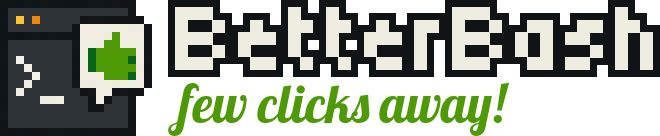
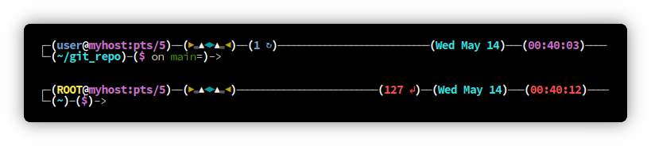

<h1>
    <a href="https://betterbash.cz0.cz">
    
    </a>
</h1>
  
  
# :point_right: Visit [betterbash.cz0.cz](https://betterbash.cz0.cz) for WebUI configurator! :point_left:

## :sparkles: Features
- :zap: Simple installation without dependencies or additional fonts.
- :performing_arts: Username (highlighted if root) and hostname.
- :art: Unique host avatar based on hostname. Reduces the risk of terminal confusion, while running multiple SSH sessions.
- :1234: Shows number of background processes if more than zero.
- :straight_ruler: Line separating commands output.
- :arrow_down: Shows exit code if other than zero.
- :clock4: Date and time. Time changes color if exit code other than zero.
- :file_folder: Current directory.
- :traffic_light: Git status (if current directory inside git repository).
- :scroll: Rapid history search with up/down arrows based on current input.
- :lock: No service behind it: the prompt, the installer and the theme decoder are shell scripts, and the configurator is a static page.

## Preview
<p align="center">
    <a href="https://betterbash.cz0.cz">
    
    </a>
</p>

### :star: Give a Star! 

Support this project by **giving it a star**. Thanks!

## :rocket: Install:
Every command does the same three things: **fetch** the BetterBash tree into
`~/.bb`, **ask** whether to go on (answer `y`, or `n` and nothing happened beyond a
directory of readable files), then **source the prompt of what was fetched**, which
installs the tree into `~/.bb` - the directory it was fetched into - and puts it on
the prompt of that very shell. Nothing is piped into a shell, so the fetched scripts
can be read before they are run.

The eight characters of the theme are `vN-y_5uA`: one code, one colour scheme.
The word `rand` draws a random theme on the machine that runs the command, and a
**new one on every run** - run the command again and you get another theme, so
`rand` is also how a reroll is asked for. A command that names no theme at all
keeps whatever this machine already wears. Configure it at
[betterbash.cz0.cz](https://betterbash.cz0.cz),
which prints these commands for what you picked - including the tag of the
release it points at, which is worth knowing when you update.

with **git**
```
git clone -q --depth 1 --branch 0.1.3 https://github.com/czoczo/BetterBash ~/.bb && read -p"$(<~/.bb/q)" -n1 && [[ $REPLY == [Yy] ]] && . ~/.bb/prompt/bb.sh vN-y_5uA
```
with **curl**
```
mkdir -p ~/.bb && curl -sL https://betterbash.cz0.cz/bb.tgz | tar -C ~/.bb -xz && read -p"$(<~/.bb/q)" -n1 && [[ $REPLY == [Yy] ]] && . ~/.bb/prompt/bb.sh vN-y_5uA
```
with **wget**
```
mkdir -p ~/.bb && wget -q -O - https://betterbash.cz0.cz/bb.tgz | tar -C ~/.bb -xz && read -p"$(<~/.bb/q)" -n1 && [[ $REPLY == [Yy] ]] && . ~/.bb/prompt/bb.sh vN-y_5uA
```
with **openssl** (needs no git, curl or wget)
```
mkdir -p ~/.bb && printf 'GET /bb.tgz HTTP/1.1\r\nHost: betterbash.cz0.cz\r\nConnection: close\r\n\r\n' \
| openssl s_client -quiet -connect betterbash.cz0.cz:443 -servername betterbash.cz0.cz 2>/dev/null \
| sed '1,/^\r$/d' | tar -C ~/.bb -xz && read -p"$(<~/.bb/q)" -n1 && [[ $REPLY == [Yy] ]] && . ~/.bb/prompt/bb.sh vN-y_5uA
```
The question is written for bash (`[[ ]]`); for a script or a container, tick
**Auto** on the page and the command has no question in it at all, so nothing is
left to answer (there, `sh ~/.bb/installbb.sh vN-y_5uA` installs without
sourcing anything, because a script is not the shell that wants the prompt).
Its words are not in the command either: `~/.bb/q` is a file of the tree that was
just fetched, and the command reads the question out of it - so the message can be
as long as answering deserves, the command stays one line long, and the words are
read in the same directory as the files they are about.

`bb.tgz` holds the tree at its own root, so `tar -C ~/.bb -xz` unpacks it into
`~/.bb` and `~/.bb` is what you say yes to - the archive carries no directory of
its own, the command names the one it wants. `mkdir -p` is in the command because
tar wants the directory it unpacks into to exist, which `git clone` needs no help
with. The tree installs nothing by itself: it carries a file named `install-pending`,
and the **first** sourcing of its `prompt/bb.sh` installs the tree and takes that
file away. That is why the last thing the command does is to source the prompt - it
is the install and the activation in one step, and no `. ~/.bashrc` is needed. Every
later sourcing of that file is only a prompt, and the flag is what says so; a
`prompt/bb.sh` of a tree that was installed already knows it never installs
anything.

The install does not make a directory of its own either: it writes `bb.sh`,
`bb-theme.sh`, `git-prompt.sh`, `removebb.sh`, `theme.sh`, `theme-code` and `version`
into `~/.bb`, next to the `prompt/` and `installbb.sh` it copied them out of. Two
copies of the prompt live there and do different jobs: `~/.bb/prompt/bb.sh` is the
tree's own, sourced once by the install command, and `~/.bb/bb.sh` is the installed
one, which `~/.bashrc` sources in every shell after it.

Answering `n` leaves the fetched tree where it is, still pending: read it, and run
`. ~/.bb/prompt/bb.sh` later if you decide (with no theme word, it keeps the theme
of the machine). Nothing in it installs itself at a later shell start - a shell that
starts only mentions it - and `rm -rf ~/.bb` takes it away. A tree is still checked
before it is copied: `installbb.sh` refuses one that anyone but you can write, and
copies only the files it knows instead of the whole tree.

## :wrench: Uninstall:
The uninstaller is installed with the prompt, so removing needs no theme code and
nothing is fetched - the page prints this one command under all four methods:
```
sh ~/.bb/removebb.sh
```
It takes `~/.bb` with it, the fetched tree of the last install command included, and
the two blocks it added to `~/.bashrc` and `~/.inputrc`. A bash session needs a
restart for it to take effect. A machine that fetched BetterBash but never installed
it has nothing to uninstall: `rm -rf ~/.bb` is enough.

## :microscope: Development

Everything BetterBash needs is in this repository, and nothing runs a server:

| Path | What it is |
|---|---|
| `prompt/bb.sh` | the prompt itself (bash) |
| `prompt/bb-theme.sh` | theme library: validates a code, decodes it to the nine prompt colours, draws a random one (`sh`, POSIX) |
| `prompt/git-prompt.sh` | vendored [git-prompt](https://github.com/git/git/blob/master/contrib/prompt/git-prompt.sh) |
| `installbb.sh` | installer: copies the prompt out of a fetched tree into `~/.bb`, the directory the tree itself was fetched into; sourced by `prompt/bb.sh` of that tree, run directly by a script (`sh`, POSIX) |
| `install-pending` | the flag inside a fetched tree: its first `prompt/bb.sh` sourcing installs it, and this file is what the install takes away |
| `q` | the question an install command asks, read out of the fetched tree (`read -p"$(<~/.bb/q)"`) so the command carries no message of its own |
| `removebb.sh` | uninstaller, installed with the prompt so removing needs no fetch (`sh`, POSIX) |
| `getbb.sh` | installer of the legacy path, downloading one file at a time (`sh`, POSIX) |
| `.inputrc` | readline bindings for history search on the arrow keys |
| `webpage/frontend` | the configurator page (Vue, built statically) |

The Pages workflow builds the page and stages `bb.tgz` next to it, so
`https://betterbash.cz0.cz/bb.tgz` holds exactly `prompt/`, `installbb.sh`,
`removebb.sh`, `VERSION_APP.txt`, `.inputrc`, `install-pending` and `q` - the tree at
the root of the archive, with no directory of its own, so it unpacks straight into the
`~/.bb` a command names - and the page fetches from its own origin. That is what
makes both domains of the deployment - `betterbash.cz0.cz` and `bb.cz0.cz` - install
from themselves. The same files are staged loose as
well, which is what the legacy `getbb.sh` path downloads.

A theme code is an argument of the installer, never part of a URL, and it is
decoded by `prompt/bb-theme.sh` on the target machine. `tests/golden/` pins the
colours of every code that has ever been handed out, so decoding cannot drift.

### Run the WebUI and the downloaded files locally
```
./dev.sh                     # WebUI on :5173, HTTPS file server on :8443
./dev.sh --help              # ports, interfaces, alternative checkout, files only
```
`./dev.sh` stages `bb.tgz` (and the loose files of the legacy path: `getbb.sh`,
`removebb.sh`, `.inputrc`, `prompt/`) into `webpage/frontend/public/` (generated,
not in version control), so the dev server serves them and the fetch commands on
the page point at the dev server. Only the openssl method, which insists on TLS,
gets the second listener with a self-signed certificate under `.dev/`. The git tab
would otherwise clone a tag that does not exist yet, so locally it points at the
origin and branch of this checkout. Restart `./dev.sh` after editing the shell
scripts, or restage them with `./tests/stage-downloads.sh webpage/frontend/public`.

The WebUI dev server listens on **`0.0.0.0`** (`--site-host`), so a browser on
another machine can open `http://<this machine>:5173` and install from it - the
commands it prints fetch from that address, because they follow the origin the page
was loaded from.

### Try the installation commands
```
./test-install.sh            # all four fetch commands of the page, run as printed
                             # into throwaway HOMEs, then reports every check
./test-install.sh --live https://betterbash.cz0.cz   # against a deployment
```
It stages the working copy into `bb.tgz`, serves it over HTTP and HTTPS on free
ports, and turns the package into a local git repository tagged like a release, so
even the git command needs no network. What it checks, among others: the installed
files and the decoded theme and the `PS1` the prompt builds; that answering `n`, or
having no terminal, installs nothing; that openssl delivers the package byte for
byte (the legacy text pipeline used to eat four bytes of it); that the pending flag
of a fetched tree is what makes its first sourcing an install and every later one
only a prompt, and that neither a later shell nor a checkout of this project
installs a tree; that `installbb.sh` refuses a planted, incomplete or faked tree;
the installer under `sh`, `bash` and `dash`; and the theme rules of a reinstall.

### Tests
```
./tests/test-theme.sh        # decoder against the golden fixtures, under dash and bash
node tests/test-avatar.mjs     # the host avatar of the page, drawn as the shell draws it
./test-install.sh            # the fetch commands of the page, see above
./tests/test-legacy-pipe.sh  # the legacy getbb.sh path, while it is served
./tests/test-shellcheck.sh   # shellcheck over every script, in its own dialect
```

### WebUI options

What the commands are built from lives in `webpage/frontend/src/config.js` and its
`.env.production` / `.env.development`: `VITE_BB_INSTALL_BASE_URL` (where `bb.tgz`
is fetched from; empty means *the origin that served this page*, which is what
production does), `VITE_BB_TLS_BASE_URL` (the openssl request), `VITE_BB_REPO_URL`
and `VITE_BB_RELEASE_REF` (the git command, pinned to the tag in
`VERSION_APP.txt`). A non-production build marks itself with a badge next to the
banner, because its commands point at the local server.

### Hosting

`.github/workflows/pages_deploy.yaml` builds the page, stages `bb.tgz` and the
loose files next to it, deploys to GitHub Pages, then waits for the new artifact
and installs from it (`--live` runs of both install paths). The domains answer from
there; TLS is the host's job.

Two bridges are still standing and both are meant to go. `getbb.sh` - the old
"download one file at a time, pipe it into a shell" installer - is no longer what
the page prints, but install commands of that shape are in other people's notes, so
it is still served and still tested (`./tests/test-legacy-pipe.sh`); deleting it is
a documentation change plus a removal. The Azure container app that served
`https://bb.cz0.cz/<code>/getbb.sh` answers those older commands for a while,
because a static host cannot rewrite a path - once its traffic drops to zero it can
be deleted together with its registry and its DNS records.

## :bar_chart: Star History

[](https://www.star-history.com/#czoczo/BetterBash&Date)


## License

GNU General Public License v3.0 or later

See [LICENSE](LICENSE) to see the full text.
